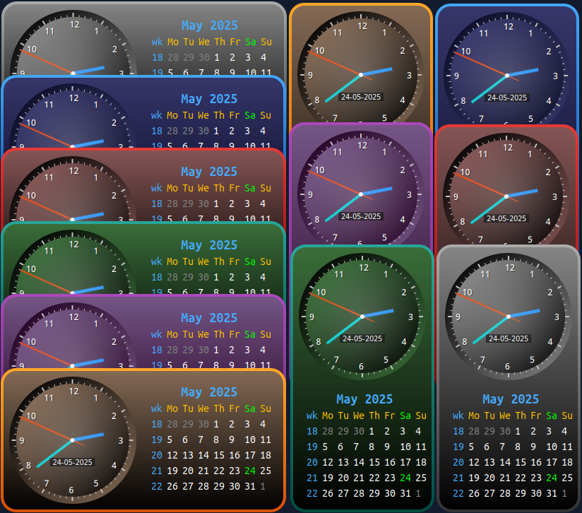

# Analog Clock & Calendar Conky

This repository contains two Conky configurations to display an analog clock and customizable calendar widget on your desktop.



## Features

- Displays an analog clock and monthly calendar with:
  - Highlighted "Today" date
  - Week numbers (optional)
  - Color-coded weekdays, weekend days, and days outside the current month
- Fully customizable:
  - Fonts and sizes
  - Colors for each element
  - Spacing and positioning
- Lightweight and efficient, built using Lua and Cairo.

## Getting Started

### Prerequisites

Ensure you have Conky installed on your system. If not, install it using the following instructions based on your distro:

- **Ubuntu/Debian**: `sudo apt install conky-all`
- **Fedora**: `sudo dnf install conky`
- **Arch**: `sudo pacman -S conky-cairo`

Additionally, ensure Lua and Cairo libraries are available on your system.

### Installation

- Clone this repository:
   ```bash
   git clone https://github.com/wim66/Analog-Clock-Calendar.git
   cd Calendar-Conky
   ```

### Customization

#### Calendar Appearance

The calendar appearance can be customized by editing the `calendar.lua` script. Key settings include:

- **Font and Size**:
  ```lua
  local font_name = "Ubuntu Mono"
  local font_size = 16
  ```

- **Positioning**:
  ```lua
  local start_x = 40
  local start_y = 40
  ```

- **Colors**:
  ```lua
  local colour_month = "#44AAFF"     -- Month name
  local colour_weekdays = "#CCCCCC" -- Weekday headers
  local colour_days = "#FFFFFF"     -- Normal days
  local colour_today = "#00FF00"    -- Today's date
  local colour_outside = "#555555"  -- Days outside the current month
  local colour_weeknums = "#44AAFF" -- Week numbers
  ```
- **Language**:
  ```lua
  local week_starts = "monday" -- monday or sunday
  local language = "english" -- english, dutch
  You can add more languages in the translations section as needed
  ```

- **Spacing**:
  ```lua
  local day_spacing = 22
  ```

For a detailed explanation of each setting, refer to the comments in the `calendar.lua` script.

---

### How to change colors in `layout.lua` for Design-2

To change the box and border colors in Design-2:

1. **Open** the file `Design-2/scripts/layout.lua` in a text editor.

2. **Available color schemes** can be found in `Design-2/scripts/colour_schemes.lua`. Some predefined options include:
   - `gray`
   - `blue`
   - `red`
   - `orange`
   - `green`
   - `purple`
   - You can also add your own color scheme to `colour_schemes.lua` and use it in `layout.lua`.

3. **Select your desired colors** by editing the following lines in `layout.lua` (located near the top of the script):

   ```lua
   local my_box_colour = colours.box_gray
   local my_border_colour = colours.border_gray
   ```


4. **Save the file** and restart Conky to see your changes.

---

## Contributing

Feel free to fork this repository and make your own modifications.

## License

This project is licensed under the MIT License. See the [LICENSE](LICENSE) file for details.

## Author

Created by [Wim66](https://github.com/wim66).